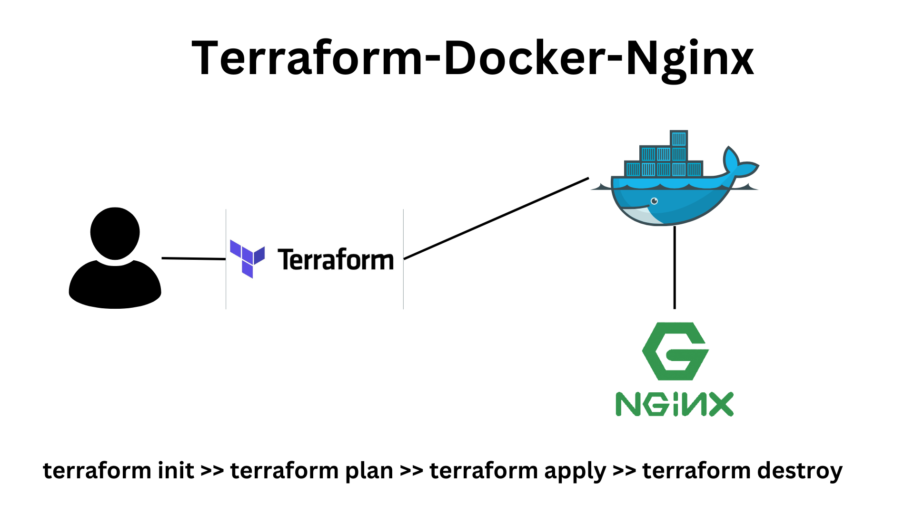

# Terraform Nginx Container with Docker

This project demonstrates the use of Terraform to create an Nginx container using the Docker provider. It pulls the Nginx image and runs a container with a specified port configuration.

## Resources

- **docker_image**: Pulls the latest Nginx Docker image from Docker Hub.
- **docker_container**: Creates a Docker container from the Nginx image and exposes it on port 8000.

## Configuration

- **Provider**: Uses the `kreuzwerker/docker` provider to interact with Docker.
- **Ports**: Maps the internal port `80` of the Nginx container to external port `8000` on the host machine.

## Example

This configuration pulls the Nginx image and runs it in a container named `nginx_container`. The container will serve content on `localhost:8000`.

## How to use

1. Initialize Terraform: `terraform init`
2. Apply the configuration: `terraform apply`
3. Access Nginx: Open a browser and go to `http://localhost:8000`.
4. Destroy Terraform Infrastructure: `terraform destroy`
